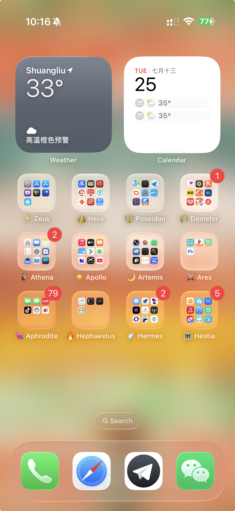

# iPhone Olympian Layout

A personal Codex skill for organizing a connected iPhone Home Screen with [Unjiggle](https://github.com/chungty/unjiggle).

It preserves the Dock, keeps existing widgets, creates a recoverable backup before writes, and classifies apps into a 12 Olympian emoji+English folder taxonomy.

## Screenshot

Place your iPhone Home Screen screenshot at `assets/iphone-home-screen.png`.



## Install

Clone this repository into your Codex skills directory:

```bash
git clone <repo-url> ~/.codex/skills/iphone-olympian-layout
```

Then ask Codex to use `iphone-olympian-layout` when checking or rewriting your iPhone Home Screen layout.

## Folder Taxonomy

- `⚡ Zeus`: system, Apple account, settings, passwords, App Store, testing, support
- `👑 Hera`: finance, banking, payment, tax, government services
- `🔱 Poseidon`: maps, navigation, transit, travel, hotels
- `🌾 Demeter`: shopping, food, local life, daily supply, basic health
- `🦉 Athena`: work, AI, notes, documents, projects, productivity
- `☀️ Apollo`: music, video, reading, podcasts, media libraries
- `🌙 Artemis`: camera, photos, weather, sensing, alerts, car/road context
- `⚔️ Ares`: job hunting, exams, prep, competitive goals
- `💘 Aphrodite`: social expression, communities, short-video feeds, events
- `🔥 Hephaestus`: utilities, hardware companions, small practical tools
- `🪽 Hermes`: communication, networking, proxy/VPN, browsers, carriers, SMS filtering
- `🏛️ Hestia`: home, smart home, appliances, pets, household utilities

See [SKILL.md](SKILL.md) for routing, [references/taxonomy.md](references/taxonomy.md) for classification rules, and [references/unjiggle-workflow.md](references/unjiggle-workflow.md) for device-write safeguards.
